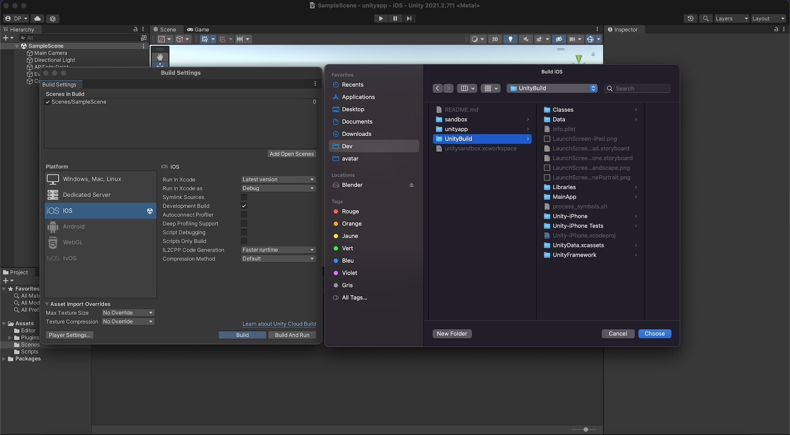
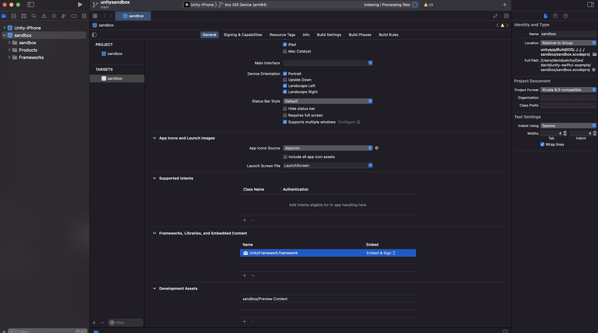

# unity-swiftui-example

This repository demonstrates how to integrate Unity 2020.2.1f1 into
a Swift iOS app based on SwiftUI and built with XCode 12.

This repository is heavily based on the example published by Unity Technologies
available [here](https://github.com/Unity-Technologies/uaal-example/blob/master/docs/ios.md).

## Features

* Unity integration into SwiftUI
* Communication from Unity to native code
* Communication from native code to Unity **without** `SendMessage()`

The last point will allow you to transfer heavy data
without the need to serialize it to a string beforehand.

## Build

### 1, Unity Project

* Open the Unity project located in the `unitapp/` folder
* Select the scene `SampleScene.unity`
* In `File > Build Settings...`, select the iOS target
* Click the `Build` button and build in the director `UnityBuild` (so, `[REPO]/UnityBuild`)

### 2. XCode Project

* Open the workspace `unitysandbox.xcworkspace` file, and not the `.xcodeproj` file
* Ensure the UnityFramework framework is listed

## How

For a complete explanation of the architecture of this example, please have a
look at my two blog posts:

* [https://davidpeicho.github.io/blog/unity-integration-swiftui/](https://davidpeicho.github.io/blog/unity-integration-swiftui/)
* [https://davidpeicho.github.io/blog/unity-swiftui-integration-revisited/](https://davidpeicho.github.io/blog/unity-swiftui-integration-revisited/).

The second link is an improvement of the first one. The `main` branch of this repository is in the same state as the second blog post.

## FAQ

#### Unity doesn't render to my app

Between the moment you create the `UnityFramework` instance, and the moment you
can display it, it seems like there is an issue. Some people try to add a delay,
but this is definitely a hack.

In this example, it is assumed that whenever the API script starts, the Unity
window should be ready to be shown. This is achieved by sending a first message
from Unity to the native code. Whether this will work in every cases or not
is questionable, but for now it has done a good job for me.
